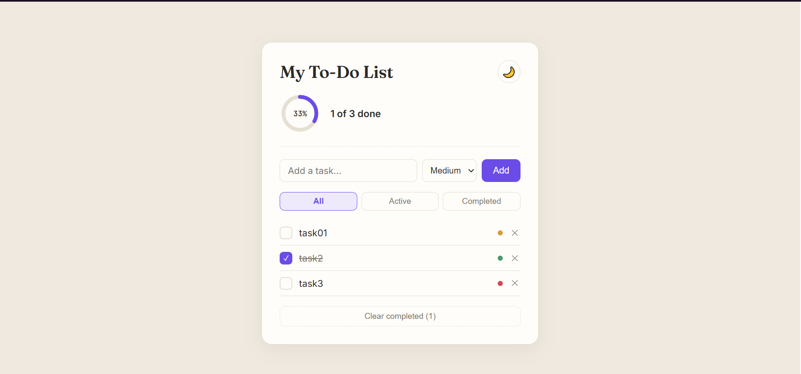
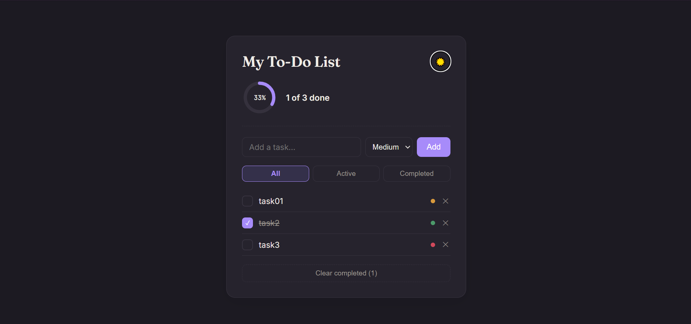

# React To-Do App

A modern and responsive To-Do application built with **React** and **Vite** to practice React fundamentals while creating a clean, user-friendly task management application.
This project demonstrates state management, component-based architecture, React Hooks, local storage persistence, filtering, editing, theme switching, and progress tracking.

---

## Features

- Add new tasks
- Edit existing tasks
- Mark tasks as completed
- Delete tasks
- Add tasks by pressing **Enter**
- Set task priority (Low, Medium, High)
- Filter tasks:
  - All
  - Active
  - Completed
- Circular progress indicator
- Clear all completed tasks
- Automatically saves tasks using Local Storage
- Light/Dark mode with persistent theme
- Browser tab updates with remaining tasks
- Responsive design

---

## Preview

### Light Mode



### Dark Mode



---

## Getting Started

### 1. Clone the repository

```bash
git clone https://github.com/zuni-developer/To-Do-App.git
```

### 2. Navigate into the project

```bash
cd To-Do-App
```

### 3. Install dependencies

```bash
npm install
```

### 4. Start the development server

```bash
npm run dev
```

The app will be available at:

```
http://localhost:5173
```

---

## Production Build

Create an optimized production build:

```bash
npm run build
```

Preview the production build locally:

```bash
npm run preview
```
---

## Future Improvements

- Due dates
- Categories/Tags
- Search tasks
- Drag & Drop task ordering
- Task analytics
- Cloud synchronization
- Reminder notifications

---